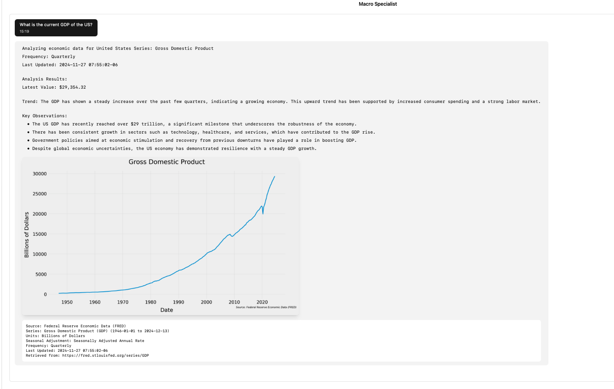

## Project overview

Macroeconomic Specialist is an AI Chat bot that allows users to ask questions on economic data that is available in the
FRED database. The chatbot is designed to provide users with insights and analysis on economic data with source citations, as well
plots of the extracted data observations.

### How it works

## Setup instructions

### Test without running server. Run from root directory of the project

```bash
python local_test.py
```

### Test on local host with UI
Start FastAPI backend server from root directory of the project. Runs on localhost:8000

```bash
uvicorn main:app --reload
```

Navigate to frontend and start dev sever. Runs on localhost:5173

```bash
pnpm dev
```



On startup the backend will instantiate the MacroeconomicsSpecialist class which will load the vector DB. The
VectorDBManger will attempt to seed Pinecone with
a few popular Fred Series ('US_GDP': 'GDP', 'US_INFLATION': 'CPIAUCSL', 'EU_INFLATION': "FPCPITOTLZGEUU", '
US_UNEMPLOYMENT': 'UNRATE', 'US_INTEREST_RATE': 'DFF').
If any series already exists it will be skipped.